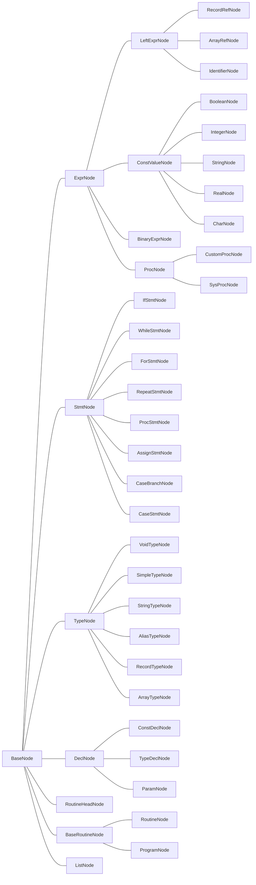
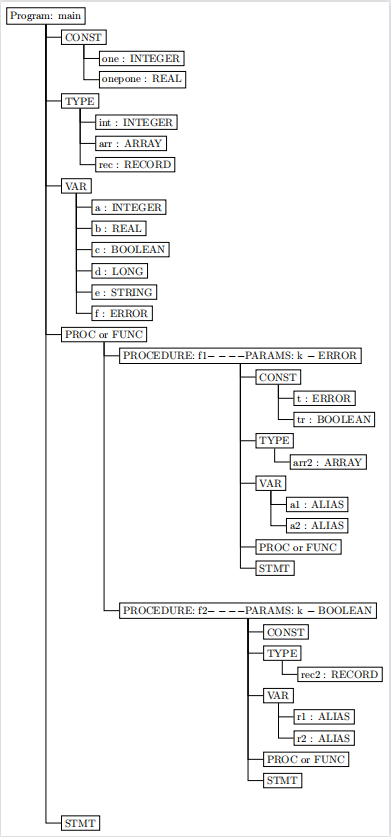

<center><strong><font size="50">本科实验报告</font></strong></center>


| 课程名称 | 编译原理         |
| -------- | ---------------- |
| 姓名     |                  |
| 学院     | 计算机学院       |
| 系       | 计算机系         |
| 专业     | 计算机科学与技术 |
| 学号     |                  |
| 指导老师 | 冯雁             |

<div style="page-break-after:always"></div>

# 序言

## 概述

​		本项目为类PASCAL语言的简易编译器，用lex完成词法分析，yacc完成语法分析，并生成语法分析树、中间代码和目标代码（汇编代码）。以下为编译器所支持的类PASCAL语言的功能：

数据类型：integer, longint, char, boolean, string, array, record

系统函数：writeln, write, abs, str, length, sqr, sqrt, chr, ord, pred, succ


## 文件说明

**src**

​	main.cpp：主函数，用于整合各功能

​	scanner.l：lex源码，用于词法分析

​	parser.y：yacc源码，用于语法分析

**CMakeLists**：用于cmake

**report** 

​	report.pdf：项目报告

**test**

​	< name >.pas：测试代码


## 运行环境与工具

运行环境：linux，Ubuntu16.04

工具：cmake, flex, bison, llvm9.0.0

编译操作：

此处默认当前位置是工程目录内，默认llvm装在~处

```sh
mkdir build
cd build
export LLVM_DIR=~/clang+llvm-9.0.0-x86_64-linux-gnu-ubuntu-16.04/lib/cmake/llvm
cmake ..
make
```

运行操作：

```sh
./compiler [-optional] <-IR/-S> <source pascal file>
比如：./compiler -O -IR ../test/AST.pas
```


## 分工

| 组员   | 分工                                      |
| ------ | ----------------------------------------- |
| 周寒靖 | 词法分析，语法分析，AST可视化，主函数main |
| 顾哲涵 | 生成目标代码，测试集，cmake               |
| 邢怡婷 | 中间代码，代码优化                        |


# 第一章 词法分析

词法分析负责处理编译器读入的程序字符串，将其转化成一个个独立token，留待后续语法分析使用。

## 1.1 lex原理

​		lex接收到字符串，将其与常规表达式进行匹配。 每次读入一个输入字符，直到找到一个匹配的模式。 如果能够找到一个匹配模式，Lex 就返回一个标记。如果没有可以匹配的常规表达式，将会报错。一个 .l文件通过 lex 公用程序来传递，并生成 C 的输出文件。

​		一个lex程序分成3段，分别是定义区、规则区和辅助函数区。定义区是 C++和 Lex 的全局声明，规则区是词法规则，辅助函数区是补充的 C++函数。 这些段以%%来分界。

```sh
{定义区}
%%
{规则区}
%%
{辅助函数区}
```

## 1.2 具体实现

### 1.2.1 定义区

​		定义区主要是所需的C++头文件、全局变量和一些参数设置。

```c++
#include<iostream>
#include<stdio.h>
#include<string>
#include<stdexcept>
#include "parser.hpp"
#include "ast/base.hpp"
#include "ast/decl.hpp"
#include "ast/expr.hpp"
#include "ast/identifier.hpp"
#include "ast/stmt.hpp"
#include "ast/type.hpp"
#undef YY_DECL  
#define YY_DECL int yylex(yy::parser::semantic_type* lval, yy::parser::location_type* loc)
#define YY_USER_ACTION loc->step(); loc->columns(yyleng);
using token = yy::parser::token::yytokentype;
```

### 1.2.2 规则区

​		规则区是整个lex程序的核心，根据类pascal语言的词法规则，将对应字符串转化成标记。标记的对应关系如下：

<table border="2" bordercolor="black" width="300" cellspacing="0" cellpadding="5">
    <tr>	<td>类别</td> <td>字符</td> <td>标记</td>		</tr>    
    <tr>	<td  rowspan="20">运算符、界符</td> <td>(</td> <td>LP</td>		</tr>
    <tr>	<td>)</td> <td>RP</td>	</tr>
    <tr>	<td>[</td> <td>LB</td>	</tr>
    <tr>	<td>}</td> <td>RB</td>	</tr>
    <tr>	<td>.</td> <td>DOT</td>	</tr>
    <tr>	<td>..</td> <td>DOTDOT</td>	</tr>
    <tr>	<td>;</td> <td>SEMI</td>	</tr>
    <tr>	<td>,</td> <td>COMMA</td>	</tr>
    <tr>	<td>:</td> <td>COLON</td>	</tr>
    <tr>	<td>*</td> <td>MUL</td>	</tr>
    <tr>	<td>/</td> <td>TRUEDIV</td>	</tr>
    <tr>	<td>+</td> <td>PLUS</td>	</tr>
    <tr>	<td>-</td> <td>MINUS</td>	</tr>
    <tr>	<td>>=</td> <td>GE</td>	</tr>
    <tr>	<td>></td> <td>GT</td>	</tr>
    <tr>	<td><=</td> <td>LE</td>	</tr>
    <tr>	<td><</td> <td>LT</td>	</tr>
    <tr>	<td><></td> <td>UNEQUAL</td>	</tr>
    <tr>	<td>=</td> <td>EQUAL</td>	</tr>
    <tr>	<td>:=</td> <td>ASSIGN</td>	</tr>
    <tr>	<td  rowspan="28">关键字</td> <td>and</td> <td>AND</td>		</tr>
    <tr>	<td>array</td> <td>ARRAY</td>	</tr>
    <tr>	<td>case</td> <td>CASE</td>	</tr>
    <tr>	<td>const</td> <td>CONST</td>	</tr>
    <tr>	<td>div</td> <td>DIV</td>	</tr>
    <tr>	<td>mod</td> <td>MOD</td>	</tr>
    <tr>	<td>do</td> <td>DO</td>	</tr>
    <tr>	<td>downto</td> <td>DOWNTO</td>	</tr>
    <tr>	<td>else</td> <td>ELSE</td>	</tr>
    <tr>	<td>end</td> <td>END</td>	</tr>
    <tr>	<td>for</td> <td>FOR</td>	</tr>
    <tr>	<td>function</td> <td>FUNTION</td>	</tr>
    <tr>	<td>goto</td> <td>GOTO</td>	</tr>
    <tr>	<td>if</td> <td>IF</td>	</tr>
    <tr>	<td>not</td> <td>NOT</td>	</tr>
    <tr>	<td>of</td> <td>OF</td>	</tr>
    <tr>	<td>or</td> <td>OR</td>	</tr>
    <tr>	<td>xor</td> <td>XOR</td>	</tr>
    <tr>	<td>begin</td> <td>BEGIN</td>	</tr>
    <tr>	<td>procedure</td> <td>PROCEDURE</td>	</tr>
    <tr>	<td>program</td> <td>PROGRAM</td>	</tr>
    <tr>	<td>repeat</td> <td>REPEAT</td>	</tr>
    <tr>	<td>then</td> <td>THEN</td>	</tr>
    <tr>	<td>type</td> <td>TYPE</td>	</tr>
    <tr>	<td>until</td> <td>UNTIL</td>	</tr>
    <tr>	<td>var</td> <td>VAR</td>	</tr>
    <tr>	<td>while</td> <td>WHILE</td>	</tr>
    <tr>	<td>record</td> <td>RECORD</td>	</tr>
    <tr>	<td  rowspan="3">系统常数</td> <td>true</td> <td>SYS_CON</td>	</tr>
    <tr>	<td>false</td> <td>SYS_CON</td>	</tr>
    <tr>	<td>maxint</td> <td>SYS_CON</td>	</tr>
    <tr>	<td  rowspan="10">系统函数</td> <td>abs</td> <td>SYS_FUNCT</td>	</tr>
    <tr>	<td>chr</td> <td>SYS_FUNCT</td>	</tr>
    <tr>	<td>length</td> <td>SYS_FUNCT</td> </tr>
    <tr>	<td>odd</td> <td>SYS_FUNCT</td>	</tr>
    <tr>	<td>ord</td> <td>SYS_FUNCT</td>	</tr>
    <tr>	<td>pred</td> <td>SYS_FUNCT</td> </tr>
    <tr>	<td>sqr</td> <td>SYS_FUNCT</td>	</tr>
    <tr>	<td>sqrt</td> <td>SYS_FUNCT</td> </tr>
    <tr>	<td>str</td> <td>SYS_FUNCT</td>	</tr>
    <tr>	<td>succ</td> <td>SYS_FUNCT</td> </tr>
    <tr>	<td rowspan="2">系统过程</td> <td>write</td> <td>SYS_PROC</td>	</tr>
    <tr>	<td>writeln</td> <td>SYS_PROC</td>	</tr>
    <tr>	<td rowspan="6">数据类型</td> <td>boolean</td> <td>SYS_TYPE</td> </tr>
    <tr>	<td>char</td> <td>SYS_TYPE</td>	</tr>
    <tr>	<td>integer</td> <td>SYS_TYPE</td>	</tr>
    <tr>	<td>longint</td> <td>SYS_TYPE</td>	</tr>
    <tr>	<td>real</td> <td>SYS_TYPE</td>	</tr>
    <tr>	<td>string</td> <td>SYS_TYPE</td>	</tr>
    <tr>	<td >整数</td> <td>[+-]?[0-9]+</td> <td>INTEGER</td>	</tr>
    <tr>	<td >实数</td> <td>[+-]?[0-9]+"."[0-9]+("e"[+-]?[0-9]+)?</td> <td>REAL</td>	</tr>
    <tr>	<td >变量名</td> <td>[a-zA-Z_]([a-zA-Z0-9_])*</td> <td>ID</td>	</tr>
    <tr>	<td >字符</td> <td>'[^']'</td> <td>CHAR</td>	</tr>
    <tr>	<td >字符串</td> <td>'('[^']'|'')+'</td> <td>STRING</td>	</tr>
    <tr>	<td rowspan="3">注释</td> <td>{...}</td> <td> </td> </tr>
    <tr>	<td>(*...*)</td> <td> </td>	</tr>
    <tr>	<td>//...</td> <td> </td>	</tr>
</table>


# 第二章 语法分析

语法分析负责接收词法分析传来的token序列，根据既定的语法规则，输出抽象语法树结构。

## 2.1 yacc原理

​		yacc是语法分析器的生成工具，能生成LALR分析器。yacc编译器能将.y文件转化成.cpp/.c文件，方便与后续其他源码文件一起运行。

​		一个yacc程序与lex程序类似，分为3段：定义区、规则区和辅助函数区。定义区是C++头文件、全局变量声明、终结符和非终结符的声明、参数设置等等。规则区是语法规则，即文法的非终结符及产生式集合，以及归约整个产生式时应执行的操作。辅助函数区包括在规则段中用到或者在语法分析器的其他部分用到的函数，这一部分一般会被直接拷贝到yacc编译器产生的cpp源文件中。三者由%%分隔。

```sh
{定义区}
%%
{规则区}
%%
{辅助函数区}
```

## 2.2 抽象语法树构建

抽象语法树整体结构如下图所示。



### 2.2.1 BaseNode类

``BaseNode``类是一个抽象类，不实现具体功能，被``ExprNode, StmtNode, TypeNode, DelNode, RoutineHeadNode, BaseRouitneNode, ListNode``继承，重载其成员函数，实现后续功能。

```c++
class BaseNode{
    public:
        BaseNode() {}
        ~BaseNode() {}
        virtual llvm::Value *codegen(CodegenContext &) = 0;
};
```

### 2.2.2 ExprNode类

``ExprNode``被大部分实体类继承，是一个表达式类。其子类如下：

``LeftExprNode``：表示可获得值，也就是左值。包括记录``RecordRefNode``、数组``ArrayRefNode``和自定义变量``IdentifierNode``。

``ConstValueNode``：表示常量，因为常量类型很多，所以ConstValue是一个抽象类，具体由``IntegerNode、RealNode、BooleanNode、CharNode、StringNode``四个子类完成。

``BinaryExprNode``：表示二元表达式，节点存储有左表达式``lval``、右表达式``rval``和操作符``op``。

```c++
class BinaryExprNode: public ExprNode{
    private:
        BinaryOp op;
        std::shared_ptr<ExprNode> lhs, rhs;
    public:
        BinaryExprNode(
            const BinaryOp op, //操作符
            const std::shared_ptr<ExprNode>& lval, //左表达式
            const std::shared_ptr<ExprNode>& rval//右表达式
            ) : op(op), lhs(lval), rhs(rval) {}
        ~BinaryExprNode() = default;
        llvm::Value *codegen(CodegenContext &) override;
        friend class ASTvis;
        friend class ASTopt;
};
```

``ProcNode``：表示过程/函数节点，包括用户自定义的过程``CustomProcNode``和系统过程``SysProcNode``。

### 2.2.3 StmtNode类

``StmtNode``是一个语句类，其本身是抽象类，但它的子类特征是该类会进行操作，比如赋值、比较、条件控制等。其子类与类pascal语言的基本操作一一对应：``IfStmtNode, WhileStmtNode, ForStmtNode, RepeatStmtNode, ProcStmtNode, AssignStmtNode, CaseBranchNode, CaseStmtNode``。

### 2.2.4 TypeNode类

``TypeNode``是一个类型类，其子类与类pascal支持的数据类型一一对应：``VoidTypeNode, SimpleTypeNode, StringTypeNode, AliasNode, RecordTypeNode, ArrayTypeNode``。

### 2.2.5 DeclNode类

​		``DeclNode``是一个声明类，包括常量声明``ConstDeclNode``、变量声明``ParamNode``和类型声明``TypeDeclNode`` 。三者大同小异，都存储声明时对应对象的名字、类型和值(若声明时被赋值)。如下源码中，``name``存储常量名，``val``存储常量值。

```c++
class ConstDeclNode: public DeclNode{
    private:
        std::shared_ptr<IdentifierNode> name;
        std::shared_ptr<ConstValueNode> val;
    public:
        ConstDeclNode(const std::shared_ptr<IdentifierNode>& name, const std::shared_ptr<ConstValueNode>& val) : name(name), val(val) {}
        ~ConstDeclNode() = default;
        llvm::Value *codegen(CodegenContext &) override;
        friend class ASTvis;
};
```

### 2.2.6 Routine类

​		``Routine``是一个过程类，包括常量声明、类型声明、变量声明、函数声明和语句部分。下面是``Routine``的一个构造函数，对一个过程的过程名、变量名、返回值等等做初始化。

```c++
RoutineNode(
            const std::shared_ptr<IdentifierNode> &name, 
            const std::shared_ptr<RoutineHeadNode> &header, 
            const std::shared_ptr<CompoundStmtNode> &body, 
            const std::shared_ptr<ParamList> &params, 
            const std::shared_ptr<TypeNode> &retType
): BaseRoutineNode(name, header, body), params(params), retType(retType) {}
```

### 

## 2.3 抽象语法树可视化

​		抽象语法树通过latex实现可视化。在生成每个节点的同时，往< name >.tex文件中写入对应的latex代码。若要查看抽象语法树，用texmaker等软件将.tex文件转化成.pdf文件即可。

### 2.3.1 latex相关语法

​		``node``可以新建一个节点，一个pascal程序只需要一个``program:<name>``根。其他子节点要被包含在``child``中，如此不断嵌套，可以增加树的深度。

```latex
%开头
\documentclass{minimal} 
\usepackage{tikz} 
%%%< 
\usepackage{verbatim} 
\usepackage[active,tightpage]{preview} 
\PreviewEnvironment{tikzpicture} 
\setlength\PreviewBorder{5pt}% 
%%%> 
\usetikzlibrary{trees}  
\begin{document}
\tikzstyle{every node}=[draw=black,thick,anchor=west]  
\tikzstyle{selected}=[draw=red,fill=red!30]            
\tikzstyle{optional}=[dashed,fill=gray!50]             
\begin{tikzpicture}[
    grow via three points={one child at (0.5,-0.7) and   
    two children at (0.5,-0.7) and (0.5,-1.4)},          
    edge from parent path={(\tikzparentnode.south) |- (\tikzchildnode.west)}  
]
%构造树结构，例：
\node {root}
child { node {name1}
	child { node {name2}}
	child { node {name3}}
}
	child [missing] {}
	child [missing] {}
%结尾
\end{tikzpicture}
\end{document}
```

### 2.3.2 可视化结果

​		将< name >.tex文件转换成pdf，如下图是某测试程序的抽象语法树。




# 第三章 语义分析

# 第四章 代码生成

# 第五章 优化考虑

# 第六章 测试结果

